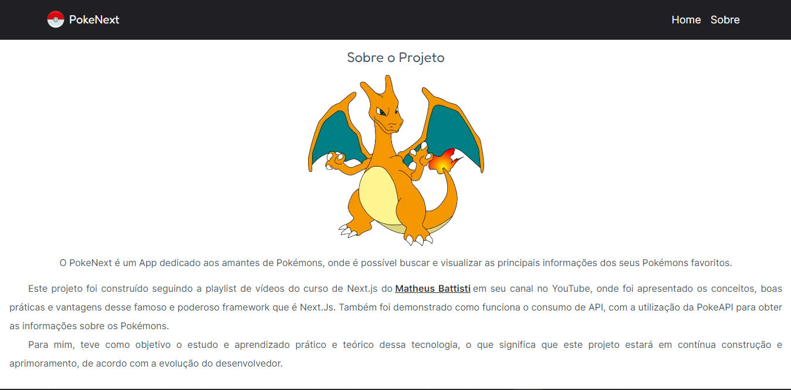

<h4 align="center"> 
	🚧  Projeto em construção...  🚧
</h4>

## LICENSE!

[](https://github.com/ManoelPatrocinio/pokenext/edit/mainLICENSE)

# Sobre o projeto

Página para exibição das informações de Pokémons, através do consumo da API PokéAPI. Feita com o intuito de prática e aprendizado do framework Next js.

## TECNOLOGIAS USADAS

- Nextjs
- TypeScript
- TailwindCss
- Html 5
- Css 3

## Melhorias Futuras

- Usu do React Query

## Layout

<div style="display:flex; justify-content: space-between">



</div>

### Pré-requisitos

Antes de começar, você vai precisar ter instalado em sua máquina as seguintes ferramentas:
[Git](https://git-scm.com), e ReactJS
Além disto, é bom ter um editor para trabalhar com o código como [VSCode](https://code.visualstudio.com/)

### 🎲 Rodando o Projeto

```bash
# Clone este repositório
$ git clone <https://github.com/ManoelPatrocinio/pokenext>

# Acesse a pasta do projeto no terminal/cmd
$ cd pokenext

# Instale as dependências iniciais
$ npm install
$ npm install --global yarn


# Execute a aplicação
$ yarn dev

# O servidor inciará na porta:3000 - acesse <http://localhost:3000>


```

### Autores

Feito por <a href="https://github.com/matheusbattisti/curso_nextjs_yt/blob/main/15_pokenext/public/images/pokeball.png"           target="_blank"> Matheus Battisti</a> & Manoel Patrocinio 👋🏽 Entre em contato!

[](https://www.instagram.com/patrocinioiii/) [](https://linkedin.com/in/manoel-patrocinio-1b342b203)
[](mailto:manoelpatrocinio99@gmail.com)
